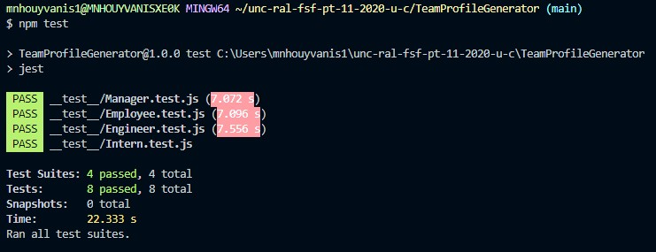
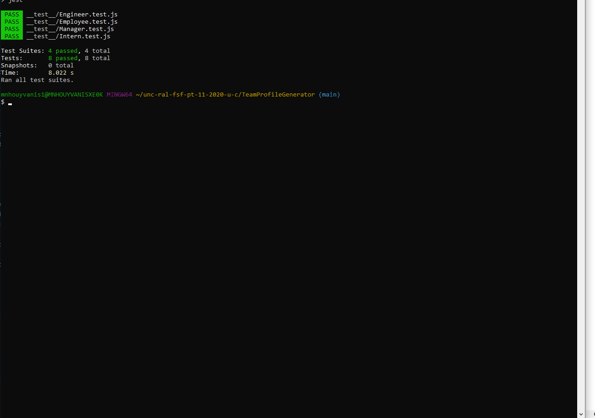
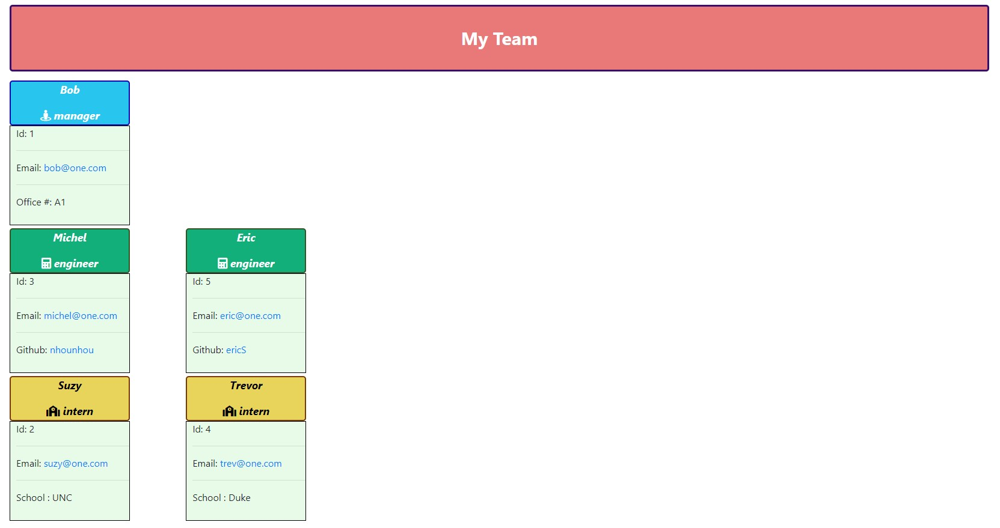

# TeamProfileGenerator
by Michel Nhouyvanisvong  
Node.js command-line application that takes in information about employees on a software engineering team, then generates an HTML webpage that displays summaries for each person

# Table of Content
- [User Story](#user-story)
- [Acceptance Criteria](#acceptance-criteria)
- [Installation](#installation)
- [Launch the Application](#launch-the-application)
- [Initial Test Command](#initial-test-command)
- [My Approach](#my-approach)
- [Results](#results)
- [Screen Shot](#screen-shot)
    - [Test Results](#test-results)
    - [Video Demonstration](#Video-demonstration)
    - [Link to deploy team profile page](#link-to-deploy-team-profile-page)

# User Strory
AS A manager  
I WANT to generate a webpage that displays my team's basic info  
SO THAT I have quick access to their emails and GitHub profiles

# Acceptance Criteria
GIVEN a command-line application that accepts user input  
WHEN I am prompted for my team members and their information  
THEN an HTML file is generated that displays a nicely formatted team roster based on user input  
WHEN I click on an email address in the HTML  
THEN my default email program opens and populates the TO field of the email with the address  
WHEN I click on the GitHub username  
THEN that GitHub profile opens in a new tab  
WHEN I start the application  
THEN I am prompted to enter the team manager’s name, employee ID, email address, and office number  
WHEN I enter the team manager’s name, employee ID, email address, and office number  
THEN I am presented with a menu with the option to add an engineer or an intern or to finish building my team  
WHEN I select the engineer option  
THEN I am prompted to enter the engineer’s name, ID, email, and GitHub username, and I am taken back to the menu  
WHEN I select the intern option  
THEN I am prompted to enter the intern’s name, ID, email, and school, and I am taken back to the menu  
WHEN I decide to finish building my team  
THEN I exit the application, and the HTML is generated  

# Installation
```
npm init -y
npm inquirer
```

# Launch the Application
```
node app.js
```

# Initial Test Command
```
npm test
```

# My Approach
The presentation of the team have to have a sense of structure, or hierarchy.  
So I'm presenting the team member in a row. Each row representing a role within the team.  
As you will see in the video demonstration, I'm entering the team member in any order.
That is why I used an array variable to store the team data.  
I'm only building the html file only after the team has been completely build.  
And to do so, I'm using 3 strings variable for each role (`mgrData`, `engData` and `intData`). I'm looping thru the team data array and add a team member in the appropriate html role variable.  
And at the end I writting and concatenating all the html strings variable, which is minimising the repetitive use of the fs methods writeFileSync or appendFileSync.

# Results
The file generated is `TeamProfile.html` in the `output` folder.

# Screen Shot
### Test Results  

### Video demonstration

### Link to deploy team profile page
[Team Profile link](https://nhounhou.github.io/TeamProfileGenerator/output/TeamProfile.html)
